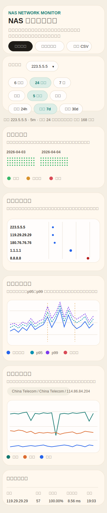

# NAS Speed Monitor

面向 NAS 的外网监测面板，提供两类长期观测：

- 分钟级心跳探测：多目标 `ping`，用于监控外网连通性、延迟抖动和异常时段
- 周期性正式测速：基于 Ookla 官方 `speedtest` CLI，记录下载、上传、延迟和测速节点历史

项目已经按当前极空间 NAS 的实际部署方式和移动端使用习惯做过优化，适合作为常驻 Docker 服务运行。

## 当前版本

- 单容器部署，SQLite 持久化历史数据
- 支持 `1m / 5m / 1h` 三档心跳聚合
- 默认 5 条心跳链路：
  - `223.5.5.5` `AliDNS`，国内主基线
  - `119.29.29.29` `DNSPod`，国内副基线
  - `180.76.76.76` `Baidu DNS`，国内次级对照
  - `1.1.1.1` `Cloudflare`，国际近点
  - `8.8.8.8` `Google Public DNS`，国际高延迟对照
- 默认 Speedtest 优选节点池：
  - `3633` `China Telecom / Shanghai`
  - `5396` `China Telecom JiangSu 5G / Suzhou`
  - `30852` `Duke Kunshan University / Kunshan`
  - `59386` `浙江电信 / HangZhou`
- 链路诊断矩阵可区分单点异常、国内链路异常和国际链路异常
- 移动端已做专门适配：
  - 图表单列纵向排列
  - 手机屏幕下缩减留白、放大线条和文字
  - 心跳图和测速图使用独立移动端比例

## 界面示例

以下样图对应当前移动端单列布局，按你提供的手机端界面样本整理，用于说明首屏结构、图表顺序和信息分层：



主要模块：

- `连通性晶格`
  - 按时间展示在线率和高延迟状态
  - 适合快速识别断流和波动时段
- `链路诊断矩阵`
  - 对比各目标的平均延迟、`p95`、`p99`、成功率和相对基线偏移
  - 适合判断异常范围是在国内链路、国际链路还是单点目标
- `心跳延迟趋势`
  - 展示平均延迟、`p95`、`p99` 和异常事件
  - 用于观察短时毛刺和尾部风险
- `正式测速趋势`
  - 展示下载、上传和延迟的长期变化
  - 结合测速节点和失败标线判断外网质量
- `底部数据表`
  - 提供心跳目标明细、事件记录和测速历史明细

## 特性

- 多目标心跳探测，默认采样间隔 `60s`
- 心跳聚合支持 `1m / 5m / 1h`
- 自动识别断流和延迟毛刺事件
- 心跳图展示 `p95 / p99`
- 正式测速使用 Ookla 官方 CLI
- 历史数据持久化到 SQLite
- 支持导出 CSV
- 支持手动触发测速
- 支持清理旧版低质量样本
- 可选内网 `iperf3` 测速

## 目录结构

```text
.
├── app.py
├── Dockerfile
├── docker-compose.yml
├── requirements.txt
├── .env.example
├── docs/
│   └── mobile-layout-sample.svg
├── templates/
│   └── index.html
└── static/
    ├── app.js
    └── style.css
```

## 快速开始

### Docker Compose

```bash
docker compose up -d --build
```

默认访问地址：

```text
http://你的NAS地址:8080
```

### 推荐优先调整的配置

- `INTERNET_SERVER_POOL`
  - 正式测速优选节点池
- `HEARTBEAT_TARGETS`
  - 心跳探测目标列表
- `SCHEDULE_MINUTES`
  - 正式测速周期
- `HEARTBEAT_INTERVAL_SECONDS`
  - 心跳采样周期
- `RETENTION_DAYS`
  - 自动清理历史数据的保留天数
- `LAN_IPERF_HOST`
  - 启用内网测速时填写 `iperf3` 服务端地址

## 配置说明

| 变量 | 默认值 | 说明 |
|---|---:|---|
| `TZ_OFFSET_HOURS` | `8` | 时区偏移 |
| `SCHEDULE_MINUTES` | `30` | 正式测速周期，单位分钟 |
| `RUN_ON_START` | `true` | 容器启动后是否立即跑一次正式测速 |
| `ENABLE_INTERNET_TEST` | `true` | 是否启用外网 Speedtest |
| `ENABLE_LAN_TEST` | `true` | 是否启用内网 `iperf3` |
| `ENABLE_HEARTBEAT_TEST` | `true` | 是否启用心跳探测 |
| `HEARTBEAT_INTERVAL_SECONDS` | `60` | 心跳采样间隔，单位秒 |
| `HEARTBEAT_TARGET` | `223.5.5.5` | 主心跳目标 |
| `HEARTBEAT_TARGETS` | `223.5.5.5,119.29.29.29,180.76.76.76,1.1.1.1,8.8.8.8` | 心跳目标列表 |
| `HEARTBEAT_TIMEOUT_SECONDS` | `2` | 单次 `ping` 超时秒数 |
| `INTERNET_SPEEDTEST_SERVER_ID` | 空 | 指定单一测速节点 |
| `INTERNET_SERVER_POOL` | `3633,5396,30852,59386` | 固定测速节点池，失败时自动回退到自动选点 |
| `INTERNET_RETRIES` | `2` | 单次 Speedtest 最多重试次数 |
| `INTERNET_RETRY_DELAY_SECONDS` | `5` | Speedtest 重试间隔 |
| `DOWNLOAD_ALERT_MBPS` | `5` | 下载低于此值标为异常 |
| `UPLOAD_ALERT_MBPS` | `1` | 上传低于此值标为异常 |
| `LATENCY_ALERT_MS` | `100` | 延迟高于此值标为异常 |
| `TEST_DURATION_ALERT_SECONDS` | `60` | 单次测速耗时超过此值标为异常 |
| `LAN_IPERF_HOST` | `192.168.1.2` | 内网 `iperf3` 服务器 IP |
| `LAN_IPERF_PORT` | `5201` | 内网 `iperf3` 端口 |
| `LAN_IPERF_DURATION_SECONDS` | `10` | 单次内网测速时长 |
| `RETENTION_DAYS` | `0` | 数据保留天数，`0` 表示不自动清理 |
| `DATA_DIR` | `/data` | SQLite 数据目录 |

## 数据存储

默认 SQLite 文件位置：

```text
/data/speed_history.db
```

在 `docker-compose.yml` 中默认映射为：

```yaml
volumes:
  - ./data:/data
```

所以容器升级或重建后，历史数据会保留。

## 已实现接口

- `GET /`
  - Web 看板
- `GET /health`
  - 健康检查
- `GET /api/history`
  - 历史记录
- `GET /api/internet/summary`
  - 外网测速汇总
- `GET /api/heartbeat/summary`
  - 主目标心跳汇总
- `GET /api/heartbeat/targets`
  - 各心跳目标汇总
- `GET /api/heartbeat/dashboard`
  - 聚合心跳视图
- `POST /api/run`
  - 手动触发正式测速
- `POST /api/admin/cleanup-legacy`
  - 清理旧版低质量样本
- `GET /api/export.csv`
  - 导出 CSV

## NAS 部署建议

### 极空间

这一版优先针对极空间做了优化：

- Docker 单容器部署流程更顺畅
- 数据目录和端口映射更适合 NAS 图形界面配置
- 默认目标池和测速节点池可以直接用于外网质量监控
- 运行时不依赖构建代理，适合长期常驻

推荐：

- 端口映射 `8080:8080`
- 数据目录映射到 NAS 本地持久化路径
- 如果只关注外网稳定性，先关闭 `ENABLE_LAN_TEST`

### 群晖 / 威联通

- 映射端口 `8080`
- 映射数据卷到 `/data`
- 使用环境变量控制测速行为
- 如果 NAS 构建镜像依赖代理，运行容器时不建议继承代理变量

## 内网测速

如果需要内网吞吐测试，先在局域网内另一台设备上启动：

```bash
iperf3 -s
```

然后把 `LAN_IPERF_HOST` 改成它的局域网 IP，并尽量满足：

- 设备长期在线
- 优先有线连接
- NAS 到该设备的网络路径稳定

## 已知限制

- Speedtest 结果会受运营商策略、节点负载和出口路由影响
- `8.8.8.8`、`9.9.9.9`、`208.67.222.222` 这类国际目标在部分网络环境下可能出现高延迟或丢包
- `114.114.114.114` 在部分网络环境下会长期限制 ICMP，默认已不再作为首选样本
- 当前前端图表基于 SVG 绘制，更适合监控和排障，不是报表系统

## 后续方向

- 异常告警推送到 Telegram / 企业微信 / 邮件
- 日报和周报导出
- 更细的事件分类
- 公网 IP 变更追踪
- 心跳目标自定义分组
